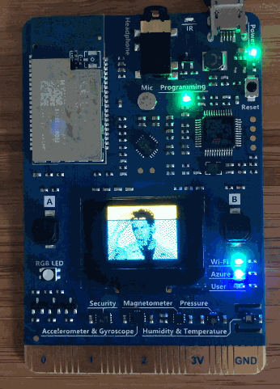

# MXing-It-Up

St Pete .NET - MX-ing it up Holiday Social

St Pete .NET has a buch of Arduino based MX Chip IoT DevKits.  So why not some fun labs!  Directional finding using the magnometer, pulling gifs with Azure IoT hub, and some optional exercises if you work ahead.  Loaner boards will be available for the day, but if a large number of people show up you may have to share.  If you wish to procure your own you can purchase the Azure IoT DevKit with the MX chip from the Amazon link below.   Expect lectures on various topics and a good bit of time to experiment on your own.  Wrap the day with a Saturday social in St Pete!

Link to MXChip IoT DevKit Model # AZ3166  - https://amzn.to/2WLfhaP

## AGENDA

Lunch happens sometime during the day.  What it will be and will it be free is tbd.  Hey, that rhymes!

* Kickoff - John Callaway
* MX Chip Lecture and Setup - John Wang
* Walkthrough of MX Chip Direction Hands on Lab - Art Garcia
* Engaged in MX Chip Direction Hands on Lab
* Azure IoT Hub Lecture - Art Garcia
* Walkthrough of MX Chip / Azure IoT Hub Lab - Joe Healy
* Walk through of Airplane Lab - Joe Healy
* Engage in MX Chip gif Lab and/or Airplane lab
* Social somewhere

## MX CHIP DIRECTION HANDS ON LAB

Configure your MX chip and push code to it showing the current orientation of the device.  Art Garcia has promised some really cool descriptions of this session here.  He has to buy beer if he lets us down.

Lab is here - https://github.com/artgarcia/mxchip_direction

## MX CHIP AZURE IOT GIF LAB

Configure your MX Chip enabled Arduino to pull gifs down from Azure IoT hub.  During this lab you will create an IoT Hub, configure your MX Arduino, push code to the arduino, connect it to the Azure IoT Hub, and pull down some gifs to the OLED screen on the Arduino. 
Lab is here - https://github.com/noopkat/mxchip-gifs/blob/master/README.md

## WHAT YOU NEED TO DO BEFORE YOU SHOW UP

Those who haven't done this before arrival will be placed on the special naughty table to do the pre-work.

Laptop with available USB port
Azure account - Free starter account here - https://azure.microsoft.com/en-us/free/
Software installed - See software requirements at this link .  NodeJS, Arduino IDE, Screen/Putty, ST-Link/V2, VS  Code with Arduino and Azure IoT extensions.  Full list of software and links at https://github.com/noopkat/mxchip-gifs/blob/master/README.md#how-do-i-run-this-example-application

## BORED

Ok, go do the airport hands on lab - https://github.com/Azure/CloudIoTHack/blob/master/README.md